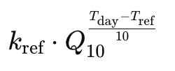

# Banana Prediction Model

This is a model used to determine how long a banana has left before it either becomes ripe or expires (or if it's already expired).

It does this using a convolutional neural network to initially classify the banana as unripe, ripe or expired. It then calls a weather API to which forcasts the temperature over the next 16 days.

We assume that a cumulative ripening score of 1 takes a banana to the next stage in its lifecycle i.e if it is unripe the model predicts it will ripen in *n* days, where *n* is the number of days required for cumulative score to get above 1. 

The following formula estimates the per-day ripening of the banana:



where *T_day* is the temperature on a given day, the reference temperature, *T_ref*, is given as 20°C which is the 'observed' temperature a banana has previously been stored at. At this temperature, it takes 4 days for the cumulative ripening score to exceed one, hence *k_ref* is 0.25 (1 / 4 days). *Q_10* is a measure of how strongly temperature affects ripening i.e in my model that value is assumed to be 2, hence the ripening process doubles for every additional 10°C. 

## Installation

Clone the repository:

```bash
git clone https://github.com/yourusername/banana-prediction-model.git
cd banana-prediction-model
```

## License

[MIT](https://choosealicense.com/licenses/mit/)